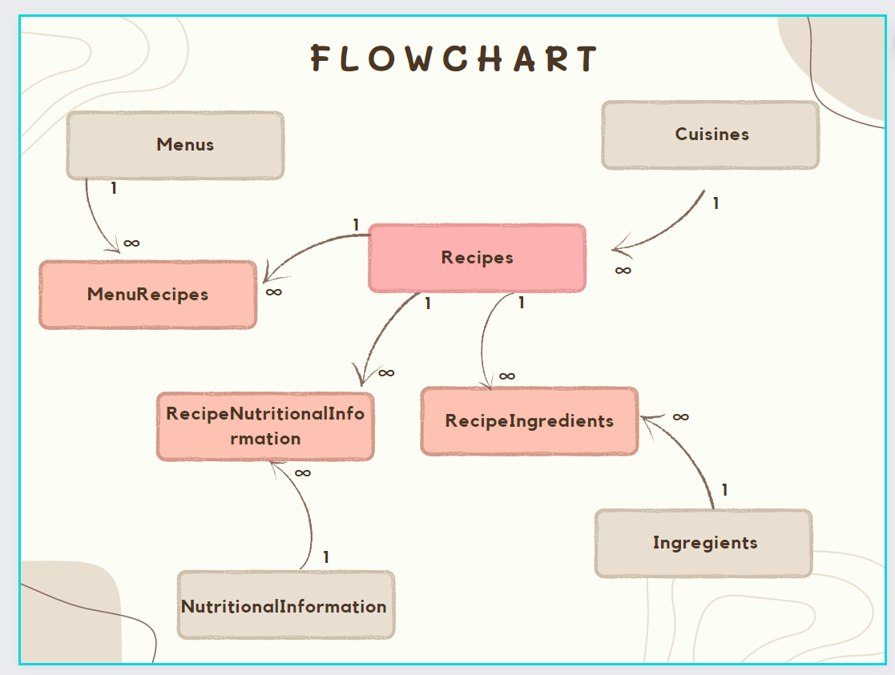

# Overview
This Api allows to access for Menu, Recipes, Cuisines and its detail for Menu planning.

## Database Model

## Tech
##### Python 3+
##### PeeWee ORM
##### Flask Web Framework
##### Docker as container
##### Pycharm as IDE
##### PostgreSQL DB
##### Postman

## Authentication
##### Google OAuth2

## TechImplementation - Setup
##### bash file - https://github.com/venkatesh9792/feature-HFback/blob/master/hfbackend.sh
##### performs docker compose build and up, runs data set up - DML scripts.

## Testing 
##### Screenshots - https://github.com/venkatesh9792/feature-HFback/blob/master/Hf-Testing.xlsx
##### postman collections - https://github.com/venkatesh9792/feature-HFback/blob/master/HF.postman_collection.json

##### Pytest - Not performed
